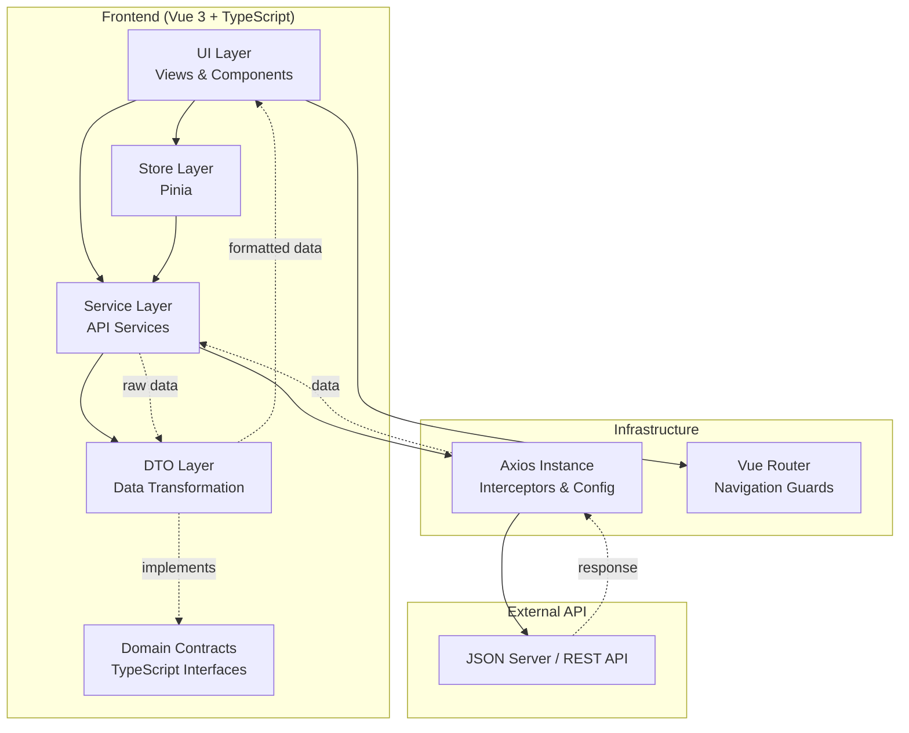

# Be.Compliance - Sistema de pedidos

Aplicação web para gestão de pedidos de entrega, desenvolvida como teste técnico para a vaga de Front-end Developer, com foco em arquitetura, separação de responsabilidades e boas práticas de engenharia front-end.


## Justificativa da Arquitetura Front-end

A arquitetura da aplicação foi estruturada em camadas, inspirada em princípios de Clean Architecture adaptados ao contexto de aplicações front-end, com o objetivo de garantir separação de responsabilidades, baixo acoplamento e facilidade de manutenção.

A UI Layer é responsável exclusivamente pela renderização da interface e pela captura de eventos do usuário, sem conhecimento direto sobre regras de negócio ou endpoints da API.
O gerenciamento de estado global, como autenticação e dados do usuário, é centralizado na Store Layer (Pinia), permitindo previsibilidade e compartilhamento de estado entre componentes.

A comunicação com o backend é isolada na Service Layer, que concentra chamadas HTTP e regras de integração, mantendo a UI e a Store desacopladas da infraestrutura.
Essa camada utiliza uma instância configurada do Axios, com interceptors para injeção automática de token Bearer e tratamento global de erros, como respostas 401 para logout automático.

Os dados retornados da API passam por uma DTO Layer, responsável por transformar dados brutos em estruturas prontas para consumo da interface, como formatação de datas, moedas e status visuais.
Essa camada utiliza Interfaces TypeScript como contratos de domínio, garantindo tipagem forte e consistência ao longo de todo o fluxo da aplicação.

A separação entre UI, domínio e infraestrutura facilita a escrita de testes unitários com Vitest, melhora a legibilidade do código e torna a aplicação mais preparada para evolução, como troca de backend, mudança de fonte de dados ou crescimento do projeto.

## Diagrama de Arquitetura (Mermaid)

O diagrama abaixo representa a organização em camadas e o fluxo de dependências da aplicação.



##  Funcionalidades

- **Autenticação Segura:** Login simulado com proteção de rotas via *Navigation Guards*.

- **Dashboard Interativo:** Listagem de pedidos com indicadores visuais de status e formatação monetária automática.

- **Responsividade:** Layout fluido que adapta tabelas complexas em *Cards* verticais em dispositivos móveis.

- **Gestão de Pedidos:**
  - Criação de novos pedidos com formulário dinâmico (adicionar/remover itens).
  - Cálculo automático de totais em tempo real.
  - Validação de campos obrigatórios.

- **Workflow de Status (Máquina de Estados):**
  - Fluxo lógico: `PENDENTE` → `PROCESSADO` → `ENTREGUE`.
  - Permite `CANCELAR` pedidos ativos com confirmação de segurança.

- **Tratamento de Erros:**
  - Blindagem contra IDs inválidos na URL.
  - Feedback visual para falhas de conexão ou pedidos inexistentes.
  - *Fallbacks* para dados incompletos vindos da API.

## Tecnologias Utilizadas

- **Vue 3** (Composition API + Script Setup)
- **TypeScript** (Tipagem estática rigorosa, Interfaces e Classes DTO)
- **Vite** (Build tool)
- **Pinia** (Gerenciamento de estado global e Autenticação)
- **Vue Router** (Roteamento dinâmico e proteção de acesso)
- **Axios** (Camada de integração HTTP)
- **JSON Server** (Backend Mock REST API)
- **CSS3 Puro** (Variáveis CSS, Scoped Styles e Media Queries - Sem frameworks de UI externos)

##  Pré-requisitos

Antes de começar, certifique-se de ter instalado em sua máquina:
- **Node.js** (v16 ou superior)
- **npm** ou **yarn**

##  Instalação e Execução

Para o sistema funcionar corretamente, é necessário rodar o **Frontend** e o **Backend (Mock)** simultaneamente em terminais separados.

### 1. Clone o repositório
```bash

git clone https://github.com/allan-sanches/frontend-test.git

```
### 2. Instale as dependências
```bash

npm install
```

### 3. Inicie o Servidor Mock (Backend)
Abra um terminal na raiz do projeto e execute:
```bash
 npx json-server db.json --port 3000
 ```
 ou

 ```bash
npm run api
```

Importante: Mantenha este terminal aberto. Ele simula a API REST na porta 3000.

### 4. Inicie a Aplicação (Frontend)
Abra um segundo terminal e execute: npm run dev

### 5. Acesse no navegador
Abra http://localhost:5173 (ou a porta indicada no seu terminal).

### Credenciais de Acesso

O sistema possui autenticação simulada. Utilize os usuários abaixo para testar:

- **Email:** dev@teste.com  
  **Senha:** 123

- **Email:** gerente@becompliance.com  
  **Senha:** 123


### 6. Testes Automatizados (Vitest)

Para garantir a confiabilidade das regras de negócio e a integridade dos componentes, o projeto utiliza **Vitest**.

### Rodando os Testes
Para executar a suíte de testes unitários:

npm run test

O que está sendo testado?
DTOs: Validação de formatação de moeda, datas e lógica de cores de status.

Services: Mocking de chamadas API para garantir isolamento.

Componentes: Renderização correta e interação básica.


##  Melhorias Futuras (Roadmap)

Este projeto já conta com autenticação robusta (Axios Interceptors e Route Guards), gerenciamento de estado com Pinia e Arquitetura Limpa.

Para levar este projeto a um ambiente de produção real, os próximos passos seriam:

### 1. Interface e Produtividade (CSS)
* **Atual:** O projeto utiliza CSS Puro e Scoped para demonstrar domínio dos fundamentos de estilização e layout.
* **Futuro:** Adotar um Framework CSS Utilitário como **Tailwind CSS** ou uma biblioteca de componentes (ex: **PrimeVue** ou **Shadcn**). Isso padronizaria o Design System, garantiria acessibilidade (A11y) nativa e aceleraria o desenvolvimento de novas telas.


### 3. Integração com Backend Real
* **Atual:** Uso do `json-server` para simular uma API RESTful.
* **Futuro:** Substituir a URL base do Axios para apontar para uma API real (Node.js, .NET ou Java) hospedada em nuvem.


### 5. Internacionalização (i18n)
* **Atual:** Textos "hardcoded" em português.
* **Futuro:** Implementar **Vue I18n** para separar os textos do código, permitindo que a aplicação suporte múltiplos idiomas (PT-BR, EN, ES) facilmente.v

Este projeto focou na lógica e na estrutura dos componentes. Para uma versão de produção, eu implementaria as seguintes melhorias para garantir uma melhor experiência de uso e manutenção:

### 1. UX e Feedback Visual
* **Atual:** Uso de `alert()` nativo do navegador.
* **Melhoria:** Implementar uma biblioteca de notificações "Toast" (como *Vue Toastification* ou *SweetAlert*). Isso deixaria as mensagens de erro e sucesso muito mais amigáveis e profissionais.

### 5. Testes
* **Atual:** Testes unitários focados na lógica do DTO.
* **Melhoria:** Expandir a cobertura de testes para os **Componentes** (verificar se o botão desabilita durante o loading, se a lista renderiza os itens corretos, etc).


## Screenshots
### Desktop


#### Login


#### Pedidos


#### novo pedido


#### Detalhes do pedido

### Mobile

#### Login


#### Pedidos


#### novo pedido


#### Detalhes do pedido


---

Este projeto foi desenvolvido com foco em clareza arquitetural, testabilidade e boas práticas de engenharia front-end, priorizando soluções simples, escaláveis e fáceis de manter.
